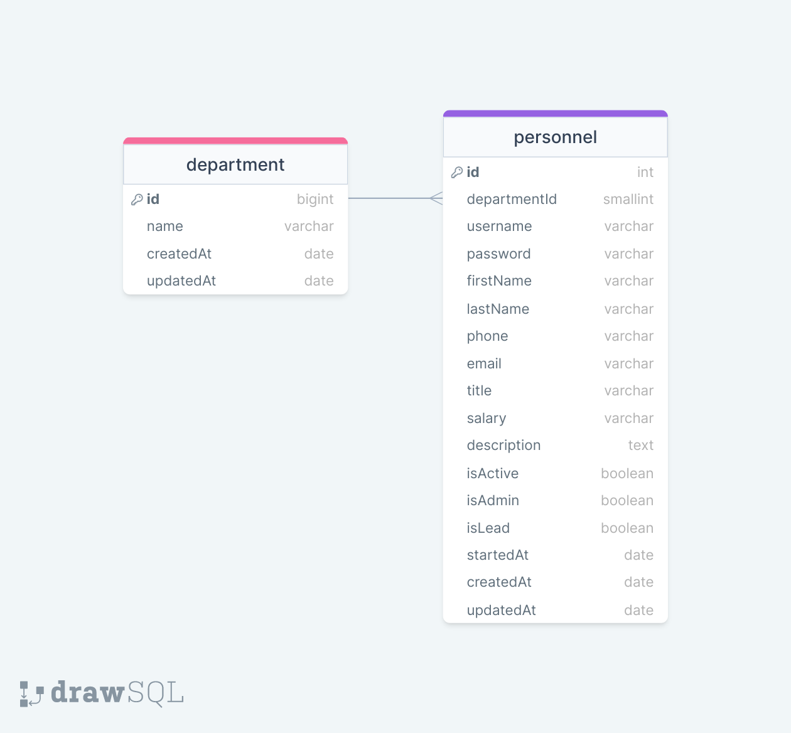

<!-- // URL?filter[key1]=value1&filter[key2]=value2
    const filter = req.query?.filter || {}
    // console.log(filter)
    // SEARCHING:
    // URL?search[key1]=value1&search[key2]=value2
    // -->

# PERSONNEL API

### ERD:



### Folder/File Structure:

```
    .env
    .gitignore
    index.js
    readme.md
    src/
        configs/
            dbConnection.js
        controllers/
            department.controller.js
            personnel.controller.js
        helpers/
            passwordEncrypt.js
        middlewares/
            errorHandler.js
            findSearchSortPage.js
        models/
            department.model.js
            personnel.model.js
        routes/
            department.router.js
            personnel.router.js
```